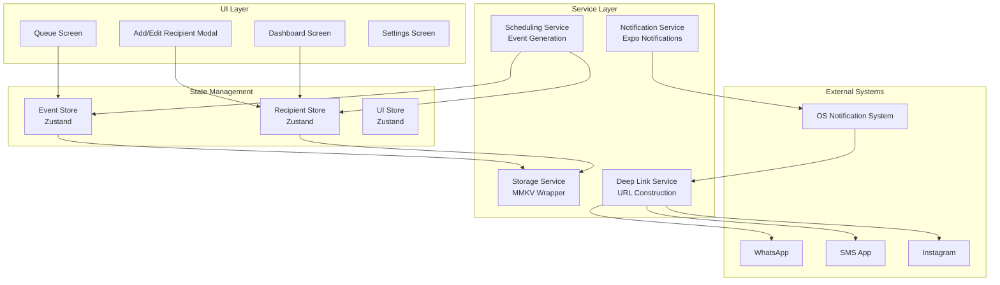
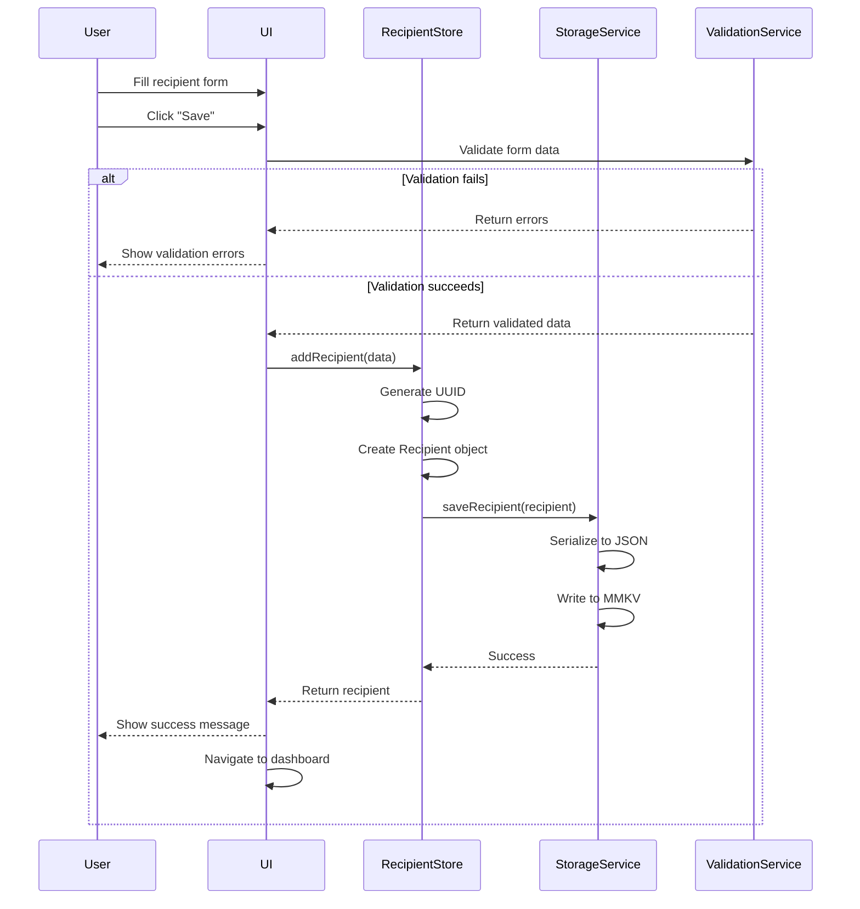
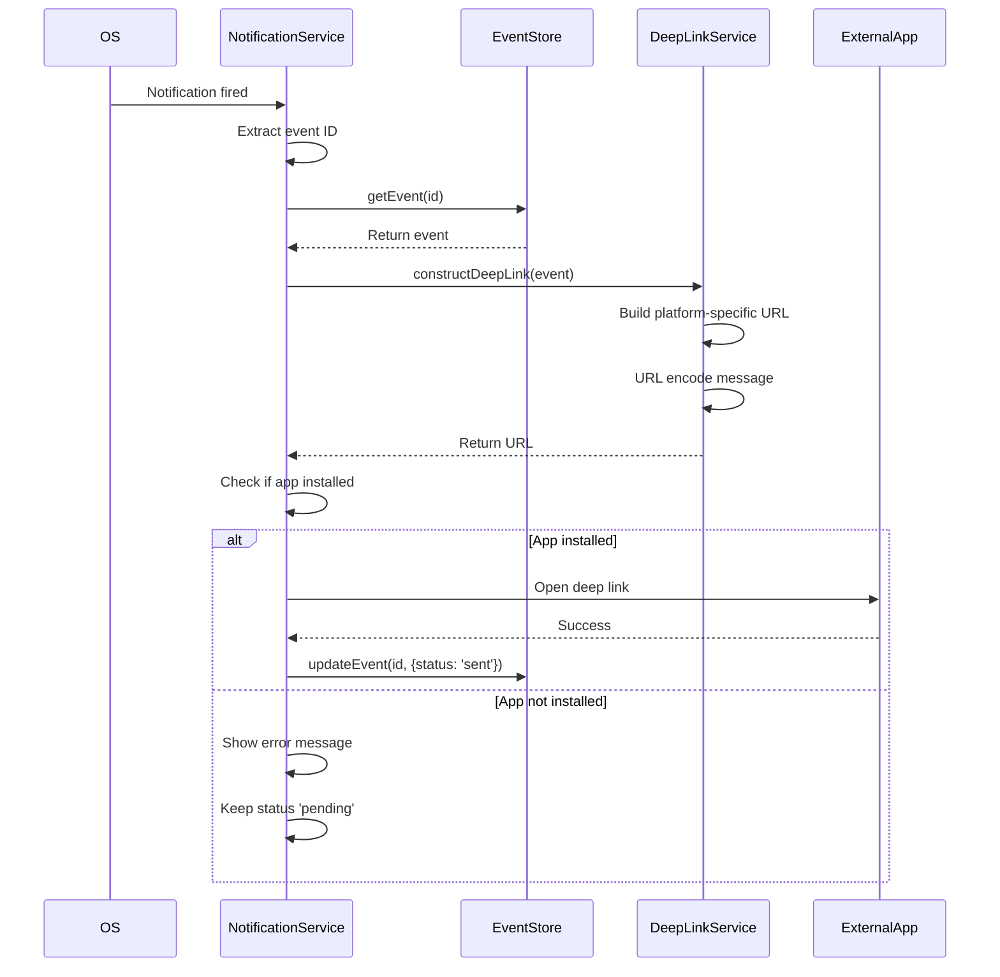

# Design Document: Playa Mobile App

## Overview

Playa is a local-first React Native mobile application built with Expo that helps users maintain relationships through scheduled messaging reminders. The app generates scheduled events that trigger local notifications, which then deep link into WhatsApp, SMS, or Instagram with pre-filled message content. The architecture emphasizes offline-first functionality, type safety, and testability.

### Core Design Principles

1. **Local-First Architecture**: All data persists locally with no cloud dependencies
2. **Type Safety**: Strict TypeScript with comprehensive interfaces
3. **Testability**: Property-based testing for critical business logic
4. **Separation of Concerns**: Clear boundaries between UI, state, services, and storage
5. **Platform Agnostic**: Shared business logic with platform-specific adapters

### System Context

The Playa app operates entirely on the user's device, scheduling local notifications that serve as reminders. When a notification fires, the user taps it to open their preferred messaging platform (WhatsApp, SMS, or Instagram) with a pre-filled message. The app does not send messages automatically due to OS sandbox restrictions.

### Key Technical Decisions

- **React Native + Expo**: Cross-platform development with managed workflow
- **TypeScript Strict Mode**: Compile-time safety and better developer experience
- **Zustand**: Lightweight state management with minimal boilerplate
- **@tanstack/react-query**: Data synchronization and caching patterns
- **MMKV over AsyncStorage**: Superior performance for key-value storage
- **NativeWind**: Tailwind CSS for React Native, familiar DX
- **Expo Router**: File-based routing with type-safe navigation
- **fast-check**: Property-based testing for scheduling algorithms


## Architecture

### High-Level System Architecture



### Component Hierarchy

```
App (Expo Router Root)
├── (tabs)
│   ├── index.tsx (Dashboard)
│   ├── queue.tsx (Queue Screen)
│   └── settings.tsx (Settings Screen)
├── modals
│   ├── add-recipient.tsx
│   ├── edit-recipient.tsx
│   └── clone-selector.tsx
└── components
    ├── RecipientCard.tsx
    ├── ScheduledEventCard.tsx
    ├── MessagePoolEditor.tsx
    ├── ScheduleConfigEditor.tsx
    └── shared
        ├── Button.tsx
        ├── Input.tsx
        ├── Modal.tsx
        └── EmptyState.tsx
```

### Data Flow

1. **Recipient Creation Flow**:
   - User opens Add Recipient modal
   - User fills form (name, platform, identifier, schedule config, messages)
   - Optional: User clones from existing recipient
   - Form validation runs
   - RecipientStore.addRecipient() called
   - StorageService persists to MMKV
   - Dashboard re-renders with new recipient

2. **Event Generation Flow**:
   - Daily cron job triggers at 00:00 (background task)
   - SchedulingService.generateDailyEvents() called
   - For each active recipient:
     - Check if message pool is non-empty
     - Generate N events based on schedule config
     - Randomly select messages from pool
     - Generate random times (Random mode) or use fixed times
   - EventStore.addEvents() called
   - NotificationService.scheduleNotifications() called
   - StorageService persists events

3. **Notification Execution Flow**:
   - OS fires notification at scheduled time
   - User taps notification
   - App opens, retrieves event by ID
   - DeepLinkService constructs platform-specific URL
   - Linking.openURL() called
   - Target app opens with pre-filled content
   - EventStore updates event status to "sent"

### State Management Architecture

**Zustand Stores**:

1. **RecipientStore**: Manages recipient CRUD operations
2. **EventStore**: Manages scheduled events and queue
3. **UIStore**: Manages UI state (modals, loading, errors)

**React Query Usage**:
- Cache recipient list for dashboard
- Optimistic updates for edit/delete operations
- Background refetch on app focus
- Stale-while-revalidate pattern


## Components and Interfaces

### Screen Components

#### Dashboard Screen (`app/(tabs)/index.tsx`)

**Purpose**: Display all active recipients and upcoming messages

**Props**: None (uses Zustand stores)

**State**:
- Loading state for initial data fetch
- Error state for failed operations
- Selected recipient for actions

**Key Features**:
- Recipient cards in scrollable list
- FAB for adding new recipient
- Pull-to-refresh
- Empty state when no recipients

**Dependencies**:
- RecipientStore (read recipients)
- EventStore (read upcoming events)
- Navigation (to add/edit modals)

#### Add/Edit Recipient Modal (`app/modals/add-recipient.tsx`)

**Purpose**: Create or edit recipient with full configuration

**Props**:
```typescript
interface AddRecipientModalProps {
  recipientId?: string; // undefined for create, ID for edit
  onClose: () => void;
}
```

**State**:
- Form data (name, platform, identifier, schedule config, messages)
- Validation errors
- Clone source selection
- Submission loading state

**Key Features**:
- Platform selection (WhatsApp/SMS/Instagram)
- Phone number validation (E.164 format)
- Instagram username validation
- Schedule config editor (Random/Fixed mode)
- Message pool editor
- Clone/import functionality

#### Queue Screen (`app/(tabs)/queue.tsx`)

**Purpose**: Display and manage all pending scheduled events

**Props**: None

**State**:
- Filter/sort options
- Selected events for bulk actions
- Edit mode state

**Key Features**:
- Chronologically sorted event list
- Edit message content inline
- Delete with confirmation
- Manual trigger button
- Visual indicators for imminent events (< 30 min)
- Confirm schedule button

### Reusable Components

#### RecipientCard (`components/RecipientCard.tsx`)

**Props**:
```typescript
interface RecipientCardProps {
  recipient: Recipient;
  onEdit: (id: string) => void;
  onDelete: (id: string) => void;
  onClone: (id: string) => void;
}
```

**Features**:
- Display name, platform icon, identifier
- Show schedule config summary
- Show message pool count
- Action buttons (edit, delete, clone)
- Platform-specific styling

#### ScheduledEventCard (`components/ScheduledEventCard.tsx`)

**Props**:
```typescript
interface ScheduledEventCardProps {
  event: ScheduledEvent;
  onEdit: (id: string) => void;
  onDelete: (id: string) => void;
  onTrigger: (id: string) => void;
}
```

**Features**:
- Display recipient name, time, message preview
- Platform icon
- Status indicator
- Countdown timer for imminent events
- Action buttons

#### MessagePoolEditor (`components/MessagePoolEditor.tsx`)

**Props**:
```typescript
interface MessagePoolEditorProps {
  messages: string[];
  onChange: (messages: string[]) => void;
  maxMessages?: number;
  maxLength?: number;
}
```

**Features**:
- Add new message template
- Edit existing messages
- Delete messages
- Character count (max 500)
- Validation feedback

#### ScheduleConfigEditor (`components/ScheduleConfigEditor.tsx`)

**Props**:
```typescript
interface ScheduleConfigEditorProps {
  config: ScheduleConfig;
  onChange: (config: ScheduleConfig) => void;
}
```

**Features**:
- Toggle between Random/Fixed mode
- Frequency slider (1-10) for Random mode
- Time picker list for Fixed mode
- Add/remove time slots
- Validation (at least 1 time in Fixed mode)


## Data Models

### TypeScript Interfaces

```typescript
// Core domain types
type Platform = 'whatsapp' | 'sms' | 'instagram';
type ScheduleMode = 'random' | 'fixed';
type EventStatus = 'pending' | 'sent' | 'cancelled';

// Recipient entity
interface Recipient {
  id: string; // UUID v4
  name: string; // Non-empty, max 100 chars
  platform: Platform;
  identifier: string; // Phone (E.164) or Instagram username
  scheduleConfig: ScheduleConfig;
  messagePool: string[]; // Array of message templates
  isActive: boolean;
  createdAt: string; // ISO 8601
  updatedAt: string; // ISO 8601
}

// Schedule configuration
interface ScheduleConfig {
  mode: ScheduleMode;
  // For random mode
  frequency?: number; // 1-10 messages per day
  // For fixed mode
  fixedTimes?: string[]; // Array of HH:mm format times
}

// Scheduled event
interface ScheduledEvent {
  id: string; // UUID v4
  recipientId: string; // Foreign key to Recipient
  recipientName: string; // Denormalized for display
  platform: Platform; // Denormalized for display
  identifier: string; // Denormalized for deep linking
  message: string; // Selected from message pool
  scheduledTime: string; // ISO 8601 datetime
  status: EventStatus;
  notificationId?: string; // Platform notification identifier
  createdAt: string; // ISO 8601
  executedAt?: string; // ISO 8601, when status changed to 'sent'
}

// Storage schema
interface StorageSchema {
  recipients: Record<string, Recipient>; // Keyed by ID
  events: Record<string, ScheduledEvent>; // Keyed by ID
  metadata: {
    lastGenerationDate: string; // ISO 8601 date
    version: string; // Schema version for migrations
  };
}

// Form state types
interface RecipientFormData {
  name: string;
  platform: Platform;
  identifier: string;
  scheduleConfig: ScheduleConfig;
  messagePool: string[];
}

interface RecipientFormErrors {
  name?: string;
  identifier?: string;
  scheduleConfig?: string;
  messagePool?: string;
}

// Clone operation types
interface CloneOptions {
  sourceRecipientId: string;
  copyScheduleConfig: boolean;
  copyMessagePool: boolean;
}
```

### Validation Rules

**Recipient Validation**:
- `name`: Non-empty, 1-100 characters, trimmed
- `identifier` (phone): E.164 format regex: `^\+[1-9]\d{1,14}$`
- `identifier` (Instagram): Alphanumeric + underscore + period, 1-30 chars: `^[a-zA-Z0-9._]{1,30}$`
- `messagePool`: At least 1 message, each 1-500 characters
- `scheduleConfig.frequency`: Integer 1-10 (Random mode)
- `scheduleConfig.fixedTimes`: At least 1 time, valid HH:mm format (Fixed mode)

**ScheduledEvent Validation**:
- `scheduledTime`: Must be in future when created
- `message`: Non-empty, max 500 characters
- `recipientId`: Must reference existing recipient

### Storage Schema Design

**MMKV Keys**:
- `recipients`: JSON string of all recipients
- `events`: JSON string of all events
- `metadata`: JSON string of metadata

**Data Access Patterns**:
1. Load all recipients on app start (infrequent, small dataset)
2. Load today's events on app start (frequent, filtered by date)
3. Update single recipient (frequent)
4. Add batch of events (daily)
5. Update single event status (frequent)

**Optimization Strategy**:
- Keep recipients and events in separate keys for partial updates
- Index events by date for efficient filtering
- Denormalize recipient data in events to avoid joins
- Limit active recipients to 50, events to 500


## Correctness Properties

*A property is a characteristic or behavior that should hold true across all valid executions of a system—essentially, a formal statement about what the system should do. Properties serve as the bridge between human-readable specifications and machine-verifiable correctness guarantees.*

### Property 1: Recipient Persistence Round-Trip

*For any* valid Recipient object, serializing to JSON, persisting to storage, and then deserializing SHALL produce an equivalent Recipient with all fields preserved.

**Validates: Requirements 1.8, 5.7, 9.2, 9.4**

**Pattern**: Round-trip property (serialize → persist → deserialize → verify equality)

**Test Strategy**: Generate random Recipients with various configurations, persist them, retrieve them, and verify deep equality of all fields including nested ScheduleConfig and MessagePool.

### Property 2: Input Validation Consistency

*For any* Recipient creation or edit operation:
- Empty or whitespace-only names SHALL be rejected
- Phone numbers not matching E.164 format SHALL be rejected for WhatsApp/SMS platforms
- Instagram usernames with invalid characters SHALL be rejected
- Message templates exceeding 500 characters SHALL be rejected
- Random mode frequency outside 1-10 range SHALL be rejected
- Fixed mode with zero times SHALL be rejected

**Validates: Requirements 1.2, 1.3, 1.4, 1.5, 1.6, 1.7, 2.2, 2.6, 3.2**

**Pattern**: Error conditions (generate invalid inputs and ensure proper rejection)

**Test Strategy**: Generate Recipients with various invalid field combinations and verify validation errors are raised with appropriate messages.

### Property 3: Random Schedule Time Bounds

*For any* Recipient configured with Random mode and frequency N, all generated ScheduledEvents SHALL have times between 09:00 and 21:00 local time, and exactly N events SHALL be generated per day.

**Validates: Requirements 2.3, 5.2**

**Pattern**: Invariant (bounds checking and count verification)

**Test Strategy**: Generate Recipients with random frequencies (1-10), run event generation, verify all times fall within [09:00, 21:00] and count equals frequency.

### Property 4: Fixed Schedule Time Matching

*For any* Recipient configured with Fixed mode and times [T1, T2, ..., Tn], the generated ScheduledEvents SHALL have exactly one event at each specified time.

**Validates: Requirements 5.3**

**Pattern**: Invariant (one-to-one mapping)

**Test Strategy**: Generate Recipients with various fixed time configurations, run event generation, verify each fixed time has exactly one corresponding event.

### Property 5: Message Pool Membership

*For any* generated ScheduledEvent, the message content SHALL be a member of the associated Recipient's MessagePool.

**Validates: Requirements 3.8, 5.5**

**Pattern**: Invariant (membership constraint)

**Test Strategy**: Generate events for Recipients with various message pools, verify each event's message exists in the source pool.

### Property 6: Empty Message Pool Constraint

*For any* Recipient with an empty MessagePool, event generation SHALL produce zero ScheduledEvents for that Recipient.

**Validates: Requirements 3.9, 5.9**

**Pattern**: Edge case (boundary condition)

**Test Strategy**: Create Recipients with empty message pools, run event generation, verify zero events are created.

### Property 7: Clone Operation Preservation

*For any* clone operation from source Recipient to target Recipient:
- WHEN copyScheduleConfig is true, the target's ScheduleConfig SHALL be deeply equal to the source's ScheduleConfig
- WHEN copyMessagePool is true, the target's MessagePool SHALL contain all messages from the source's MessagePool
- The target's name and identifier SHALL remain unchanged regardless of clone options

**Validates: Requirements 4.5, 4.6, 4.7, 4.8**

**Pattern**: Invariant (selective preservation)

**Test Strategy**: Generate source and target Recipients, perform clone operations with all combinations of flags, verify correct fields are copied and others preserved.

### Property 8: Unique Event Identifiers

*For any* batch of generated ScheduledEvents, all event IDs SHALL be unique (no duplicates).

**Validates: Requirements 5.4**

**Pattern**: Invariant (uniqueness constraint)

**Test Strategy**: Generate large batches of events (100+), collect all IDs, verify set size equals array length (no duplicates).

### Property 9: No Duplicate Events Per Recipient-Time

*For any* Recipient and scheduled time, at most one ScheduledEvent SHALL exist with that Recipient ID and scheduled time combination.

**Validates: Requirements 5.8**

**Pattern**: Invariant (uniqueness constraint)

**Test Strategy**: Attempt to generate events multiple times for the same recipient and time, verify only one event exists.

### Property 10: Initial Event Status

*For any* newly generated ScheduledEvent, the status field SHALL be set to "pending".

**Validates: Requirements 5.6**

**Pattern**: Invariant (initial state)

**Test Strategy**: Generate events and verify all have status === "pending" immediately after creation.

### Property 11: Event Status Transitions

*For any* ScheduledEvent, valid status transitions are:
- pending → sent (when deep link successfully opens)
- pending → cancelled (when user deletes event)
- No transitions from sent or cancelled states (terminal states)

**Validates: Requirements 6.7, 8.8, 8.9**

**Pattern**: State machine invariant

**Test Strategy**: Generate events in various states, attempt all possible transitions, verify only valid transitions succeed and invalid ones are rejected.

### Property 12: Chronological Event Sorting

*For any* list of ScheduledEvents, sorting by scheduledTime SHALL produce a chronologically ordered list where each event's time is less than or equal to the next event's time.

**Validates: Requirements 6.2**

**Pattern**: Invariant (ordering property)

**Test Strategy**: Generate random lists of events with random times, sort them, verify pairwise ordering (events[i].time <= events[i+1].time for all i).

### Property 13: Schedule Config Change Regeneration

*For any* Recipient, when the ScheduleConfig is modified, all pending ScheduledEvents for that Recipient SHALL be removed and new events SHALL be generated matching the new configuration.

**Validates: Requirements 2.9**

**Pattern**: Consistency invariant

**Test Strategy**: Create recipient with events, modify schedule config, verify old events are gone and new events match new config (count, times, etc.).

### Property 14: Notification Lifecycle Consistency

*For any* ScheduledEvent:
- Creating the event SHALL schedule a notification with matching time and content
- Deleting the event SHALL cancel the associated notification
- Editing the event's message SHALL update the notification content
- The event's notificationId field SHALL match the scheduled notification's ID

**Validates: Requirements 7.3, 7.4, 7.5, 7.6, 7.7**

**Pattern**: Invariant (referential consistency)

**Test Strategy**: Create, edit, and delete events while monitoring notification system, verify notifications are created/updated/cancelled accordingly and IDs match.

### Property 15: Deep Link URL Construction

*For any* ScheduledEvent:
- WHERE platform is WhatsApp, the constructed URL SHALL match pattern `whatsapp://send?phone={E164_phone}&text={encoded_message}`
- WHERE platform is SMS, the constructed URL SHALL match pattern `sms:{E164_phone}?body={encoded_message}`
- WHERE platform is Instagram, the constructed URL SHALL match pattern `instagram://user?username={username}`
- All message content SHALL be URL-encoded (special characters properly escaped)

**Validates: Requirements 8.2, 8.3, 8.4, 8.5**

**Pattern**: Invariant (format validation)

**Test Strategy**: Generate events with various platforms and messages (including special characters), construct deep links, verify URL format and encoding correctness.

### Property 16: Data Export/Import Round-Trip

*For any* complete application state (all Recipients and ScheduledEvents), exporting to JSON and then importing SHALL restore the exact same state with all data preserved.

**Validates: Requirements 9.9, 9.10**

**Pattern**: Round-trip property

**Test Strategy**: Generate random application state, export to JSON, clear state, import from JSON, verify deep equality of all Recipients and Events.

### Property 17: Input Sanitization

*For any* user-provided string input (names, messages, identifiers), the sanitized output SHALL:
- Remove leading/trailing whitespace
- Escape HTML special characters (< > & " ')
- Preserve valid Unicode characters
- Not exceed maximum length constraints

**Validates: Requirements 14.2, 14.3**

**Pattern**: Invariant (sanitization properties)

**Test Strategy**: Generate strings with various special characters, HTML tags, and edge cases, sanitize them, verify dangerous content is escaped and valid content preserved.


## Service Layer Design

### Storage Service

**Purpose**: Abstract local persistence operations using MMKV

**Interface**:
```typescript
interface IStorageService {
  // Recipient operations
  saveRecipient(recipient: Recipient): Promise<void>;
  getRecipient(id: string): Promise<Recipient | null>;
  getAllRecipients(): Promise<Recipient[]>;
  deleteRecipient(id: string): Promise<void>;
  
  // Event operations
  saveEvent(event: ScheduledEvent): Promise<void>;
  getEvent(id: string): Promise<ScheduledEvent | null>;
  getAllEvents(): Promise<ScheduledEvent[]>;
  getEventsByDate(date: string): Promise<ScheduledEvent[]>;
  deleteEvent(id: string): Promise<void>;
  
  // Bulk operations
  saveEvents(events: ScheduledEvent[]): Promise<void>;
  deleteEventsByRecipient(recipientId: string): Promise<void>;
  
  // Metadata
  getLastGenerationDate(): Promise<string | null>;
  setLastGenerationDate(date: string): Promise<void>;
  
  // Export/Import
  exportData(): Promise<string>; // JSON string
  importData(jsonData: string): Promise<void>;
  clearAllData(): Promise<void>;
}
```

**Implementation Details**:
- Use MMKV for performance (faster than AsyncStorage)
- Store recipients and events in separate keys for partial updates
- Implement in-memory cache with write-through strategy
- Handle serialization/deserialization errors gracefully
- Provide atomic operations for data consistency

**Error Handling**:
- Wrap all operations in try-catch
- Log errors with context (operation, data ID)
- Throw custom StorageError with user-friendly messages
- Implement retry logic for transient failures

### Notification Service

**Purpose**: Schedule and manage local notifications using Expo Notifications

**Interface**:
```typescript
interface INotificationService {
  // Permission management
  requestPermissions(): Promise<boolean>;
  checkPermissions(): Promise<boolean>;
  
  // Notification scheduling
  scheduleNotification(event: ScheduledEvent): Promise<string>; // Returns notification ID
  cancelNotification(notificationId: string): Promise<void>;
  updateNotification(notificationId: string, event: ScheduledEvent): Promise<void>;
  
  // Batch operations
  scheduleNotifications(events: ScheduledEvent[]): Promise<Map<string, string>>; // eventId -> notificationId
  cancelAllNotifications(): Promise<void>;
  
  // Notification handling
  handleNotificationResponse(response: NotificationResponse): Promise<void>;
  
  // Testing
  triggerTestNotification(event: ScheduledEvent): Promise<void>;
}
```

**Implementation Details**:
- Use Expo Notifications API
- Handle platform differences (iOS 64 notification limit)
- Include recipient name and message preview in notification body
- Set notification category for action buttons (future enhancement)
- Store notification ID in ScheduledEvent for cancellation
- Handle timezone conversions correctly

**Notification Content Format**:
```
Title: "Message for {recipientName}"
Body: "{messagePreview...}" (first 100 chars)
Data: { eventId: string, recipientId: string }
```

### Scheduling Service

**Purpose**: Generate ScheduledEvents based on Recipient configurations

**Interface**:
```typescript
interface ISchedulingService {
  // Event generation
  generateDailyEvents(date: string): Promise<ScheduledEvent[]>;
  generateEventsForRecipient(recipient: Recipient, date: string): Promise<ScheduledEvent[]>;
  
  // Random time generation
  generateRandomTimes(frequency: number, date: string): string[]; // Returns ISO timestamps
  
  // Validation
  validateScheduleConfig(config: ScheduleConfig): ValidationResult;
  canGenerateEvents(recipient: Recipient): boolean;
}
```

**Implementation Details**:

**Random Time Generation Algorithm**:
```typescript
function generateRandomTimes(frequency: number, date: string): string[] {
  const times: string[] = [];
  const startHour = 9; // 09:00
  const endHour = 21; // 21:00
  const totalMinutes = (endHour - startHour) * 60; // 720 minutes
  
  // Generate N unique random minutes within the range
  const usedMinutes = new Set<number>();
  
  while (times.length < frequency) {
    const randomMinute = Math.floor(Math.random() * totalMinutes);
    
    if (!usedMinutes.has(randomMinute)) {
      usedMinutes.add(randomMinute);
      
      const hour = startHour + Math.floor(randomMinute / 60);
      const minute = randomMinute % 60;
      
      const timestamp = new Date(date);
      timestamp.setHours(hour, minute, 0, 0);
      
      times.push(timestamp.toISOString());
    }
  }
  
  return times.sort(); // Return chronologically sorted
}
```

**Event Generation Logic**:
1. Check if recipient has non-empty message pool
2. Determine mode (Random or Fixed)
3. Generate times based on mode
4. For each time:
   - Create unique event ID (UUID v4)
   - Randomly select message from pool
   - Create ScheduledEvent object with status "pending"
   - Check for duplicates (same recipient + time)
5. Return array of events

**Duplicate Prevention**:
- Before creating event, query existing events for same recipient + time
- Skip creation if duplicate found
- Log warning for debugging

### Deep Link Service

**Purpose**: Construct platform-specific deep link URLs

**Interface**:
```typescript
interface IDeepLinkService {
  // URL construction
  constructDeepLink(event: ScheduledEvent): string;
  
  // URL opening
  openDeepLink(url: string): Promise<boolean>; // Returns success status
  
  // Validation
  validateDeepLink(url: string): boolean;
  canOpenURL(url: string): Promise<boolean>;
}
```

**Implementation Details**:

**WhatsApp Deep Link**:
```typescript
function constructWhatsAppLink(phone: string, message: string): string {
  const encodedMessage = encodeURIComponent(message);
  return `whatsapp://send?phone=${phone}&text=${encodedMessage}`;
}
```

**SMS Deep Link**:
```typescript
function constructSMSLink(phone: string, message: string): string {
  const encodedMessage = encodeURIComponent(message);
  return `sms:${phone}?body=${encodedMessage}`;
}
```

**Instagram Deep Link**:
```typescript
function constructInstagramLink(username: string): string {
  return `instagram://user?username=${username}`;
}
```

**URL Encoding Rules**:
- Use `encodeURIComponent()` for message content
- Preserve phone number format (E.164)
- Handle special characters: spaces, emojis, punctuation
- Maximum URL length: 2048 characters (platform limit)

**Error Handling**:
- Check if target app is installed using `Linking.canOpenURL()`
- If not installed, show error with app store link
- Log failed deep link attempts
- Provide fallback to manual copy-paste


## Error Handling

### Error Handling Strategy

**Centralized Error Handling**:
- Create custom error classes for different error types
- Use error boundaries for React component errors
- Implement global error handler for uncaught exceptions
- Log all errors with context and stack traces (development only)

**Error Classes**:
```typescript
class AppError extends Error {
  constructor(
    message: string,
    public code: string,
    public userMessage: string,
    public recoverable: boolean = true
  ) {
    super(message);
    this.name = 'AppError';
  }
}

class ValidationError extends AppError {
  constructor(message: string, public field: string) {
    super(message, 'VALIDATION_ERROR', message, true);
    this.name = 'ValidationError';
  }
}

class StorageError extends AppError {
  constructor(message: string, operation: string) {
    super(
      message,
      'STORAGE_ERROR',
      'Failed to save data. Please try again.',
      true
    );
    this.name = 'StorageError';
  }
}

class NotificationError extends AppError {
  constructor(message: string) {
    super(
      message,
      'NOTIFICATION_ERROR',
      'Failed to schedule notification. Check permissions.',
      true
    );
    this.name = 'NotificationError';
  }
}

class DeepLinkError extends AppError {
  constructor(message: string, public platform: Platform) {
    super(
      message,
      'DEEPLINK_ERROR',
      `Failed to open ${platform}. Is the app installed?`,
      true
    );
    this.name = 'DeepLinkError';
  }
}
```

### User-Facing Error Messages

**Validation Errors** (inline, near form fields):
- "Name is required"
- "Please enter a valid phone number with country code (e.g., +1234567890)"
- "Instagram username can only contain letters, numbers, underscores, and periods"
- "Message must be between 1 and 500 characters"
- "Please select at least one time for fixed schedule"
- "Frequency must be between 1 and 10 messages per day"

**Storage Errors** (toast notification):
- "Failed to save recipient. Please try again."
- "Failed to load data. Please restart the app."
- "Failed to delete recipient. Please try again."

**Notification Errors** (modal dialog):
- "Notification permissions are required. Please enable them in Settings."
- "Failed to schedule notification. Please check your device settings."

**Deep Link Errors** (toast notification):
- "WhatsApp is not installed. Install it from the App Store."
- "Failed to open SMS app. Please try again."
- "Instagram is not installed. Install it from the App Store."

### Logging Strategy

**Development Environment**:
- Log all errors with full stack traces
- Log all service operations (storage, notifications, deep links)
- Log validation failures
- Use console.log, console.warn, console.error

**Production Environment**:
- Log errors without sensitive data (no phone numbers, messages)
- Log error codes and timestamps
- No console logging (performance)
- Consider crash reporting service (future enhancement)

**Log Format**:
```typescript
interface LogEntry {
  timestamp: string;
  level: 'info' | 'warn' | 'error';
  category: string; // 'storage', 'notification', 'deeplink', 'validation'
  message: string;
  context?: Record<string, any>; // Non-sensitive context
  error?: Error;
}
```

### Retry Mechanisms

**Storage Operations**:
- Retry up to 3 times with exponential backoff (100ms, 200ms, 400ms)
- Only retry on transient errors (not validation errors)

**Notification Scheduling**:
- Retry once immediately
- If fails, mark event with error status and show user message

**Deep Link Opening**:
- No automatic retry (user-initiated action)
- Provide manual retry button in error message

### Error Recovery

**Data Corruption**:
- Validate data on load
- If invalid, attempt to repair (remove invalid entries)
- If unrepairable, offer to reset to clean state
- Always backup before reset

**Permission Denial**:
- Show clear instructions to enable permissions
- Provide deep link to app settings
- Gracefully degrade (disable notification features)

**App Crashes**:
- Persist state before operations
- On restart, check for incomplete operations
- Offer to resume or discard incomplete work


## Testing Strategy

### Dual Testing Approach

The Playa app uses a comprehensive testing strategy combining unit tests and property-based tests:

**Unit Tests**: Verify specific examples, edge cases, and error conditions
- Specific user flows (create recipient, edit message, delete event)
- Integration points between components and services
- Edge cases (empty states, boundary values)
- Error handling paths

**Property-Based Tests**: Verify universal properties across all inputs
- Scheduling algorithms (random time generation, event creation)
- Data transformations (serialization, URL encoding)
- Invariants (uniqueness, bounds checking, state transitions)
- Round-trip properties (persistence, export/import)

Both approaches are complementary and necessary for comprehensive coverage. Unit tests catch concrete bugs in specific scenarios, while property tests verify general correctness across thousands of generated inputs.

### Property-Based Testing Configuration

**Library**: fast-check (JavaScript/TypeScript property-based testing)

**Configuration**:
- Minimum 100 iterations per property test (due to randomization)
- Seed-based reproducibility for failed tests
- Shrinking enabled to find minimal failing examples
- Timeout: 5 seconds per property test

**Test Tagging Format**:
Each property test must reference its design document property:
```typescript
describe('Feature: playa-mobile-app, Property 1: Recipient Persistence Round-Trip', () => {
  it('should preserve all fields after serialize-persist-deserialize cycle', () => {
    fc.assert(
      fc.property(recipientArbitrary, async (recipient) => {
        // Test implementation
      }),
      { numRuns: 100 }
    );
  });
});
```

### Test Organization

```
__tests__/
├── unit/
│   ├── components/
│   │   ├── RecipientCard.test.tsx
│   │   ├── ScheduledEventCard.test.tsx
│   │   └── MessagePoolEditor.test.tsx
│   ├── screens/
│   │   ├── Dashboard.test.tsx
│   │   ├── Queue.test.tsx
│   │   └── AddRecipient.test.tsx
│   ├── services/
│   │   ├── StorageService.test.ts
│   │   ├── NotificationService.test.ts
│   │   ├── SchedulingService.test.ts
│   │   └── DeepLinkService.test.ts
│   └── stores/
│       ├── RecipientStore.test.ts
│       └── EventStore.test.ts
├── property/
│   ├── persistence.property.test.ts
│   ├── validation.property.test.ts
│   ├── scheduling.property.test.ts
│   ├── clone.property.test.ts
│   ├── deeplink.property.test.ts
│   └── state-transitions.property.test.ts
├── integration/
│   ├── recipient-lifecycle.test.ts
│   ├── event-generation-flow.test.ts
│   └── notification-execution.test.ts
└── helpers/
    ├── arbitraries.ts (fast-check generators)
    ├── mocks.ts
    └── fixtures.ts
```

### Property-Based Test Generators (Arbitraries)

```typescript
// arbitraries.ts
import * as fc from 'fast-check';

// Generate valid phone numbers in E.164 format
export const phoneArbitrary = fc.string({ minLength: 10, maxLength: 15 })
  .map(s => '+' + s.replace(/\D/g, '').slice(0, 14))
  .filter(s => /^\+[1-9]\d{1,14}$/.test(s));

// Generate valid Instagram usernames
export const instagramUsernameArbitrary = fc.stringOf(
  fc.oneof(
    fc.char().filter(c => /[a-zA-Z0-9._]/.test(c))
  ),
  { minLength: 1, maxLength: 30 }
);

// Generate valid message templates
export const messageArbitrary = fc.string({ minLength: 1, maxLength: 500 });

// Generate schedule configs
export const scheduleConfigArbitrary = fc.oneof(
  // Random mode
  fc.record({
    mode: fc.constant('random' as const),
    frequency: fc.integer({ min: 1, max: 10 })
  }),
  // Fixed mode
  fc.record({
    mode: fc.constant('fixed' as const),
    fixedTimes: fc.array(
      fc.integer({ min: 0, max: 23 }).chain(hour =>
        fc.integer({ min: 0, max: 59 }).map(minute =>
          `${hour.toString().padStart(2, '0')}:${minute.toString().padStart(2, '0')}`
        )
      ),
      { minLength: 1, maxLength: 10 }
    )
  })
);

// Generate complete recipients
export const recipientArbitrary = fc.record({
  id: fc.uuid(),
  name: fc.string({ minLength: 1, maxLength: 100 }),
  platform: fc.oneof(
    fc.constant('whatsapp' as const),
    fc.constant('sms' as const),
    fc.constant('instagram' as const)
  ),
  identifier: fc.string(), // Will be refined based on platform
  scheduleConfig: scheduleConfigArbitrary,
  messagePool: fc.array(messageArbitrary, { minLength: 1, maxLength: 20 }),
  isActive: fc.boolean(),
  createdAt: fc.date().map(d => d.toISOString()),
  updatedAt: fc.date().map(d => d.toISOString())
}).map(r => ({
  ...r,
  identifier: r.platform === 'instagram' 
    ? fc.sample(instagramUsernameArbitrary, 1)[0]
    : fc.sample(phoneArbitrary, 1)[0]
}));

// Generate scheduled events
export const scheduledEventArbitrary = fc.record({
  id: fc.uuid(),
  recipientId: fc.uuid(),
  recipientName: fc.string({ minLength: 1, maxLength: 100 }),
  platform: fc.oneof(
    fc.constant('whatsapp' as const),
    fc.constant('sms' as const),
    fc.constant('instagram' as const)
  ),
  identifier: fc.string(),
  message: messageArbitrary,
  scheduledTime: fc.date({ min: new Date() }).map(d => d.toISOString()),
  status: fc.oneof(
    fc.constant('pending' as const),
    fc.constant('sent' as const),
    fc.constant('cancelled' as const)
  ),
  notificationId: fc.option(fc.uuid()),
  createdAt: fc.date().map(d => d.toISOString()),
  executedAt: fc.option(fc.date().map(d => d.toISOString()))
});
```

### Unit Test Examples

**Component Testing** (React Native Testing Library):
```typescript
describe('RecipientCard', () => {
  it('should display recipient name and platform', () => {
    const recipient = createMockRecipient({ name: 'John', platform: 'whatsapp' });
    const { getByText } = render(<RecipientCard recipient={recipient} />);
    
    expect(getByText('John')).toBeTruthy();
    expect(getByText('WhatsApp')).toBeTruthy();
  });
  
  it('should call onEdit when edit button is pressed', () => {
    const onEdit = jest.fn();
    const recipient = createMockRecipient();
    const { getByLabelText } = render(
      <RecipientCard recipient={recipient} onEdit={onEdit} />
    );
    
    fireEvent.press(getByLabelText('Edit recipient'));
    expect(onEdit).toHaveBeenCalledWith(recipient.id);
  });
});
```

**Service Testing**:
```typescript
describe('SchedulingService', () => {
  it('should generate correct number of events for random mode', async () => {
    const recipient = createMockRecipient({
      scheduleConfig: { mode: 'random', frequency: 5 }
    });
    
    const events = await schedulingService.generateEventsForRecipient(
      recipient,
      '2026-02-15'
    );
    
    expect(events).toHaveLength(5);
  });
  
  it('should not generate events for empty message pool', async () => {
    const recipient = createMockRecipient({ messagePool: [] });
    
    const events = await schedulingService.generateEventsForRecipient(
      recipient,
      '2026-02-15'
    );
    
    expect(events).toHaveLength(0);
  });
});
```

### Integration Test Examples

```typescript
describe('Recipient Lifecycle Integration', () => {
  it('should create recipient, generate events, and schedule notifications', async () => {
    // Create recipient
    const recipient = await recipientStore.addRecipient({
      name: 'Test User',
      platform: 'whatsapp',
      identifier: '+1234567890',
      scheduleConfig: { mode: 'random', frequency: 3 },
      messagePool: ['Hello', 'Hi there', 'Hey']
    });
    
    // Generate events
    const events = await schedulingService.generateEventsForRecipient(
      recipient,
      new Date().toISOString().split('T')[0]
    );
    
    expect(events).toHaveLength(3);
    
    // Schedule notifications
    const notificationIds = await notificationService.scheduleNotifications(events);
    
    expect(notificationIds.size).toBe(3);
    
    // Verify events have notification IDs
    const storedEvents = await storageService.getAllEvents();
    storedEvents.forEach(event => {
      expect(event.notificationId).toBeDefined();
    });
  });
});
```

### Coverage Goals

- **Overall code coverage**: 80% minimum
- **Business logic (services)**: 90% minimum
- **Components**: 70% minimum (focus on logic, not styling)
- **Stores**: 90% minimum
- **Property tests**: All 17 properties implemented

### Test Execution

**Pre-commit**: Run all tests automatically via Husky
**CI/CD**: Run tests on pull requests
**Local development**: Watch mode for rapid feedback

**Commands**:
```bash
npm test              # Run all tests
npm test:unit         # Run unit tests only
npm test:property     # Run property tests only
npm test:coverage     # Generate coverage report
npm test:watch        # Watch mode
```


## Implementation Phases

### Phase 1: Setup & Project Structure

**Objective**: Establish project foundation with tooling, types, and basic architecture

**Tasks**:
1. Initialize Expo project with TypeScript template
2. Install and configure dependencies:
   - Zustand (state management)
   - @tanstack/react-query (data fetching)
   - react-native-mmkv (storage)
   - expo-notifications (notifications)
   - expo-router (navigation)
   - NativeWind (styling)
   - fast-check (property testing)
   - Jest + React Native Testing Library
3. Set up project structure (folders: app, components, services, stores, types, utils)
4. Define TypeScript interfaces (Recipient, ScheduledEvent, ScheduleConfig)
5. Configure ESLint, Prettier, Husky pre-commit hooks
6. Create StorageService with MMKV wrapper
7. Create Zustand stores (RecipientStore, EventStore, UIStore)
8. Write property tests for data model serialization (Property 1)
9. Set up test infrastructure and arbitraries

**Completion Criteria**:
- Project builds successfully on iOS and Android
- All types defined with strict TypeScript
- StorageService passes persistence round-trip tests
- Zero linting errors
- Pre-commit hooks working

**Estimated Effort**: 1-2 days

### Phase 2: Dashboard & Add Contact UI

**Objective**: Implement recipient creation and display functionality

**Tasks**:
1. Create Dashboard screen with tab navigation
2. Implement RecipientCard component
3. Create Add/Edit Recipient modal with form
4. Implement platform selection (WhatsApp/SMS/Instagram)
5. Add phone number validation (E.164 format)
6. Add Instagram username validation
7. Implement ScheduleConfigEditor component (Random/Fixed mode)
8. Implement MessagePoolEditor component
9. Connect form to RecipientStore
10. Add empty state and loading states
11. Write unit tests for components
12. Write property tests for validation (Property 2)

**Completion Criteria**:
- Users can create recipients with all fields
- Validation works correctly for all inputs
- Recipients display on dashboard
- Edit and delete functionality works
- All validation property tests pass
- Component tests pass

**Estimated Effort**: 2-3 days

### Phase 3: Copy/Clone Feature

**Objective**: Implement selective data copying between recipients

**Tasks**:
1. Create CloneSelector modal component
2. Add "Import from..." button to Add/Edit Recipient modal
3. Implement checkbox selection for ScheduleConfig and MessagePool
4. Implement clone logic in RecipientStore
5. Add confirmation feedback
6. Write unit tests for clone UI
7. Write property tests for clone operations (Property 7)
8. Test all combinations (config only, pool only, both)

**Completion Criteria**:
- Users can select source recipient
- Selective copying works correctly
- Target recipient preserves name and identifier
- Clone property tests pass (deep equality verification)
- UI provides clear feedback

**Estimated Effort**: 1 day

### Phase 4: Scheduling Logic

**Objective**: Implement event generation and queue management

**Tasks**:
1. Create SchedulingService with event generation logic
2. Implement random time generation algorithm
3. Implement fixed time event generation
4. Add duplicate prevention logic
5. Create Queue screen with event list
6. Implement chronological sorting
7. Add edit/delete functionality for events
8. Implement schedule regeneration on config change
9. Write property tests for scheduling (Properties 3, 4, 5, 6, 8, 9, 10, 12, 13)
10. Write unit tests for SchedulingService
11. Add daily generation trigger (background task)

**Completion Criteria**:
- Events generate correctly for Random and Fixed modes
- All times fall within 09:00-21:00 bounds
- Messages selected from pool
- Empty pools produce zero events
- No duplicate events created
- Queue displays events chronologically
- All scheduling property tests pass

**Estimated Effort**: 2-3 days

### Phase 5: Execution & Deep Linking

**Objective**: Implement notification scheduling and deep link execution

**Tasks**:
1. Create NotificationService with Expo Notifications
2. Request notification permissions on first launch
3. Implement notification scheduling for events
4. Create DeepLinkService with URL construction
5. Implement platform-specific deep link formats
6. Add URL encoding for message content
7. Handle notification tap and retrieve event
8. Open deep link using Linking API
9. Update event status on successful execution
10. Add error handling for missing apps
11. Implement notification cancellation on event delete
12. Write property tests for deep links (Property 15)
13. Write property tests for notification lifecycle (Property 14)
14. Write property tests for state transitions (Property 11)
15. Write integration tests for full flow

**Completion Criteria**:
- Notifications schedule correctly
- Tapping notification opens target app with pre-filled content
- Event status updates to "sent"
- Deep link URLs correctly formatted
- URL encoding handles special characters
- Error messages for missing apps
- All notification and deep link property tests pass
- Integration tests pass

**Estimated Effort**: 2-3 days

### Phase 6: Polish & Additional Features

**Objective**: Add remaining features and polish UX

**Tasks**:
1. Implement export/import functionality
2. Write property tests for export/import (Property 16)
3. Add input sanitization
4. Write property tests for sanitization (Property 17)
5. Implement dark mode support
6. Add accessibility labels
7. Implement loading and error states
8. Add onboarding tutorial
9. Write documentation (README, architecture docs)
10. Perform manual testing on iOS and Android
11. Fix bugs and polish UI
12. Optimize performance (lazy loading, memoization)

**Completion Criteria**:
- Export/import works correctly
- All 17 property tests pass
- 80%+ code coverage achieved
- App works on both iOS and Android
- Accessibility requirements met
- Documentation complete
- Zero known critical bugs

**Estimated Effort**: 2-3 days

### Total Estimated Timeline

**Minimum**: 8-10 days of focused development
**Realistic**: 12-15 days with testing and polish
**Buffer**: Add 20% for unexpected issues


## Technical Decisions

### MMKV vs AsyncStorage

**Decision**: Use MMKV for local storage

**Rationale**:
- **Performance**: MMKV is 10-30x faster than AsyncStorage for read/write operations
- **Synchronous API**: Allows synchronous reads when needed (better DX)
- **Encryption**: Built-in encryption support for future security enhancements
- **Reliability**: More stable, less prone to data corruption
- **Size**: Smaller footprint, better for mobile

**Trade-offs**:
- Slightly more complex setup than AsyncStorage
- Less familiar to developers (smaller community)
- Native module dependency (but well-maintained)

**Implementation**:
```typescript
import { MMKV } from 'react-native-mmkv';

const storage = new MMKV();

// Wrapper for async interface
export const StorageService = {
  async setItem(key: string, value: string): Promise<void> {
    storage.set(key, value);
  },
  async getItem(key: string): Promise<string | null> {
    return storage.getString(key) ?? null;
  },
  // ... other methods
};
```

### NativeWind vs Tamagui

**Decision**: Use NativeWind for styling

**Rationale**:
- **Familiarity**: Tailwind CSS syntax is widely known
- **Simplicity**: No complex theme configuration needed for MVP
- **Performance**: Compile-time CSS extraction, minimal runtime overhead
- **Flexibility**: Easy to customize and extend
- **Bundle Size**: Smaller than Tamagui for simple use cases

**Trade-offs**:
- Less powerful than Tamagui's component system
- No built-in animation primitives (use Reanimated separately if needed)
- Less optimized for complex design systems

**Alternative Considered**: Tamagui offers better performance for complex UIs and built-in animations, but adds complexity for MVP scope.

### Notification Scheduling Approach

**Decision**: Use Expo Notifications with daily batch scheduling

**Rationale**:
- **Platform Limits**: iOS limits to 64 scheduled notifications
- **Battery Efficiency**: Batch scheduling reduces wake-ups
- **Simplicity**: Generate events once per day at midnight
- **Flexibility**: Easy to regenerate if user changes config

**Implementation Strategy**:
1. Use Expo Background Tasks to trigger daily at 00:00
2. Generate all events for the day
3. Schedule notifications for all events
4. If approaching 64 notification limit, prioritize nearest events

**Alternative Considered**: Generate events on-demand when notification fires. Rejected due to complexity and reliability concerns.

### Deep Link URL Schema Design

**Decision**: Use standard platform-specific URL schemas

**WhatsApp**: `whatsapp://send?phone={phone}&text={message}`
- Standard schema supported by WhatsApp
- Works on both iOS and Android
- Phone must be in E.164 format (with country code)

**SMS**: `sms:{phone}?body={message}`
- Universal SMS schema
- Works on both platforms
- Falls back to default SMS app

**Instagram**: `instagram://user?username={username}`
- Opens user profile (Instagram doesn't support pre-filled DMs via deep link)
- User must manually initiate message
- Limitation of Instagram's deep linking capabilities

**URL Encoding**:
- Use `encodeURIComponent()` for message content
- Preserve phone number format (no encoding)
- Handle emojis and special characters correctly
- Maximum URL length: 2048 characters

**Fallback Strategy**:
- Check if app is installed using `Linking.canOpenURL()`
- If not installed, show error with app store link
- Provide manual copy-paste option as last resort

### State Management Architecture

**Decision**: Zustand for global state, React Query for server-like patterns

**Rationale**:
- **Zustand**: Lightweight, minimal boilerplate, TypeScript-friendly
- **React Query**: Excellent for caching, optimistic updates, background refetch
- **Separation**: Zustand for app state, React Query for data synchronization patterns

**Store Structure**:
```typescript
// RecipientStore: CRUD operations for recipients
interface RecipientStore {
  recipients: Record<string, Recipient>;
  addRecipient: (data: RecipientFormData) => Promise<Recipient>;
  updateRecipient: (id: string, data: Partial<Recipient>) => Promise<void>;
  deleteRecipient: (id: string) => Promise<void>;
  cloneRecipient: (targetId: string, sourceId: string, options: CloneOptions) => Promise<void>;
}

// EventStore: CRUD operations for events
interface EventStore {
  events: Record<string, ScheduledEvent>;
  addEvents: (events: ScheduledEvent[]) => Promise<void>;
  updateEvent: (id: string, data: Partial<ScheduledEvent>) => Promise<void>;
  deleteEvent: (id: string) => Promise<void>;
  getEventsByDate: (date: string) => ScheduledEvent[];
}

// UIStore: UI state (modals, loading, errors)
interface UIStore {
  isLoading: boolean;
  error: AppError | null;
  activeModal: string | null;
  setLoading: (loading: boolean) => void;
  setError: (error: AppError | null) => void;
  openModal: (modal: string) => void;
  closeModal: () => void;
}
```

**React Query Usage**:
```typescript
// Cache recipient list with background refetch
const { data: recipients, refetch } = useQuery({
  queryKey: ['recipients'],
  queryFn: () => recipientStore.recipients,
  staleTime: 1000 * 60 * 5, // 5 minutes
  refetchOnWindowFocus: true,
});

// Optimistic update for delete
const deleteMutation = useMutation({
  mutationFn: (id: string) => recipientStore.deleteRecipient(id),
  onMutate: async (id) => {
    await queryClient.cancelQueries({ queryKey: ['recipients'] });
    const previous = queryClient.getQueryData(['recipients']);
    queryClient.setQueryData(['recipients'], (old) => 
      old.filter(r => r.id !== id)
    );
    return { previous };
  },
  onError: (err, id, context) => {
    queryClient.setQueryData(['recipients'], context.previous);
  },
});
```

### Background Task Strategy

**Decision**: Use Expo Background Fetch for daily event generation

**Implementation**:
```typescript
import * as BackgroundFetch from 'expo-background-fetch';
import * as TaskManager from 'expo-task-manager';

const DAILY_GENERATION_TASK = 'daily-event-generation';

TaskManager.defineTask(DAILY_GENERATION_TASK, async () => {
  try {
    const today = new Date().toISOString().split('T')[0];
    const events = await schedulingService.generateDailyEvents(today);
    await notificationService.scheduleNotifications(events);
    return BackgroundFetch.BackgroundFetchResult.NewData;
  } catch (error) {
    console.error('Background task failed:', error);
    return BackgroundFetch.BackgroundFetchResult.Failed;
  }
});

// Register task to run daily
await BackgroundFetch.registerTaskAsync(DAILY_GENERATION_TASK, {
  minimumInterval: 60 * 60 * 24, // 24 hours
  stopOnTerminate: false,
  startOnBoot: true,
});
```

**Fallback**: If background task fails, generate events on app open if last generation was > 24 hours ago.

### Validation Strategy

**Decision**: Centralized validation with Zod schemas

**Rationale**:
- Type-safe validation with TypeScript inference
- Reusable schemas for forms and API boundaries
- Clear error messages
- Runtime type checking

**Implementation**:
```typescript
import { z } from 'zod';

const phoneSchema = z.string().regex(/^\+[1-9]\d{1,14}$/, 'Invalid phone number format');
const instagramUsernameSchema = z.string().regex(/^[a-zA-Z0-9._]{1,30}$/, 'Invalid username');

const recipientSchema = z.object({
  name: z.string().min(1).max(100).trim(),
  platform: z.enum(['whatsapp', 'sms', 'instagram']),
  identifier: z.string(),
  scheduleConfig: z.discriminatedUnion('mode', [
    z.object({
      mode: z.literal('random'),
      frequency: z.number().int().min(1).max(10),
    }),
    z.object({
      mode: z.literal('fixed'),
      fixedTimes: z.array(z.string().regex(/^\d{2}:\d{2}$/)).min(1),
    }),
  ]),
  messagePool: z.array(z.string().min(1).max(500)).min(1).max(100),
}).refine(
  (data) => {
    if (data.platform === 'instagram') {
      return instagramUsernameSchema.safeParse(data.identifier).success;
    } else {
      return phoneSchema.safeParse(data.identifier).success;
    }
  },
  { message: 'Invalid identifier for selected platform' }
);

// Usage in form
const validateRecipient = (data: unknown) => {
  const result = recipientSchema.safeParse(data);
  if (!result.success) {
    return { errors: result.error.flatten().fieldErrors };
  }
  return { data: result.data };
};
```

### Security Considerations

**Input Sanitization**:
```typescript
import DOMPurify from 'isomorphic-dompurify';

function sanitizeInput(input: string): string {
  // Remove leading/trailing whitespace
  let sanitized = input.trim();
  
  // Escape HTML special characters
  sanitized = DOMPurify.sanitize(sanitized, { 
    ALLOWED_TAGS: [],
    ALLOWED_ATTR: [] 
  });
  
  // Limit length
  sanitized = sanitized.slice(0, 500);
  
  return sanitized;
}
```

**Deep Link Sanitization**:
```typescript
function sanitizeForURL(message: string): string {
  // First sanitize HTML
  const sanitized = sanitizeInput(message);
  
  // Then URL encode
  return encodeURIComponent(sanitized);
}
```

**Data Encryption** (Future Enhancement):
```typescript
// MMKV supports encryption
const storage = new MMKV({
  id: 'playa-storage',
  encryptionKey: 'user-device-specific-key', // Derive from device ID
});
```

### Performance Optimizations

**Lazy Loading**:
```typescript
// Lazy load screens
const Queue = lazy(() => import('./screens/Queue'));
const Settings = lazy(() => import('./screens/Settings'));
```

**Virtualized Lists**:
```typescript
import { FlashList } from '@shopify/flash-list';

<FlashList
  data={recipients}
  renderItem={({ item }) => <RecipientCard recipient={item} />}
  estimatedItemSize={100}
/>
```

**Memoization**:
```typescript
const RecipientCard = memo(({ recipient, onEdit, onDelete }) => {
  // Component implementation
}, (prev, next) => prev.recipient.id === next.recipient.id);

const sortedEvents = useMemo(() => {
  return events.sort((a, b) => 
    new Date(a.scheduledTime).getTime() - new Date(b.scheduledTime).getTime()
  );
}, [events]);
```

**Debouncing**:
```typescript
const debouncedSearch = useMemo(
  () => debounce((query: string) => {
    // Search logic
  }, 300),
  []
);
```


## Security and Privacy

### Data Storage Security

**Local-Only Storage**:
- All data stored exclusively on device
- No cloud transmission or external API calls
- No analytics or tracking in MVP
- User has complete control over their data

**Storage Security**:
- Use MMKV with encryption capability
- Derive encryption key from device-specific identifier
- Secure storage for sensitive data (phone numbers, messages)
- No data in plain text logs

**Implementation**:
```typescript
import { MMKV } from 'react-native-mmkv';
import * as Application from 'expo-application';

// Derive encryption key from device ID
const deviceId = Application.androidId || Application.getIosIdForVendorAsync();
const encryptionKey = await deriveKey(deviceId);

const storage = new MMKV({
  id: 'playa-secure-storage',
  encryptionKey: encryptionKey,
});
```

### Input Validation and Sanitization

**Validation Layers**:
1. **Client-side validation**: Immediate feedback in UI
2. **Schema validation**: Zod schemas before storage
3. **Sanitization**: Clean all user inputs before storage/display

**Sanitization Rules**:
- Remove leading/trailing whitespace
- Escape HTML special characters (< > & " ')
- Remove control characters
- Limit string lengths
- Validate format (phone numbers, usernames)

**Implementation**:
```typescript
function sanitizeUserInput(input: string, maxLength: number = 500): string {
  // Trim whitespace
  let sanitized = input.trim();
  
  // Remove control characters
  sanitized = sanitized.replace(/[\x00-\x1F\x7F]/g, '');
  
  // Escape HTML
  sanitized = sanitized
    .replace(/&/g, '&amp;')
    .replace(/</g, '&lt;')
    .replace(/>/g, '&gt;')
    .replace(/"/g, '&quot;')
    .replace(/'/g, '&#x27;');
  
  // Limit length
  sanitized = sanitized.slice(0, maxLength);
  
  return sanitized;
}
```

### Deep Link Security

**URL Construction Safety**:
- Always use `encodeURIComponent()` for user content
- Validate phone numbers before constructing URLs
- Limit URL length to prevent overflow
- Never include sensitive data in URLs beyond what's necessary

**URL Validation**:
```typescript
function validateDeepLink(url: string): boolean {
  // Check URL length
  if (url.length > 2048) return false;
  
  // Validate URL format
  try {
    new URL(url);
  } catch {
    return false;
  }
  
  // Check for allowed schemas
  const allowedSchemas = ['whatsapp://', 'sms:', 'instagram://'];
  if (!allowedSchemas.some(schema => url.startsWith(schema))) {
    return false;
  }
  
  return true;
}
```

### Permission Handling

**Minimal Permissions**:
- Only request notification permissions (required for core functionality)
- No network permissions needed
- No contact access required
- No location access required

**Permission Flow**:
```typescript
async function requestNotificationPermissions(): Promise<boolean> {
  const { status: existingStatus } = await Notifications.getPermissionsAsync();
  
  if (existingStatus === 'granted') {
    return true;
  }
  
  const { status } = await Notifications.requestPermissionsAsync();
  
  if (status !== 'granted') {
    // Show user-friendly message with instructions
    showPermissionDeniedMessage();
    return false;
  }
  
  return true;
}
```

**Graceful Degradation**:
- If permissions denied, disable notification features
- Allow manual triggering of deep links from queue
- Provide clear instructions to enable permissions
- Never crash or block app usage

### Data Privacy

**No Logging of Sensitive Data**:
```typescript
// BAD - Don't do this
console.log('Creating recipient:', recipient.identifier, recipient.messagePool);

// GOOD - Log without sensitive data
console.log('Creating recipient:', { id: recipient.id, platform: recipient.platform });
```

**Data Export Privacy**:
- Warn user that exported JSON contains sensitive data
- Recommend secure storage of export files
- Provide option to encrypt exports (future enhancement)

**Data Deletion**:
```typescript
async function clearAllData(): Promise<void> {
  // Show confirmation dialog
  const confirmed = await showConfirmDialog(
    'Delete All Data',
    'This will permanently delete all recipients and messages. This cannot be undone.'
  );
  
  if (!confirmed) return;
  
  // Clear storage
  await storageService.clearAllData();
  
  // Cancel all notifications
  await notificationService.cancelAllNotifications();
  
  // Reset stores
  recipientStore.reset();
  eventStore.reset();
}
```

### OWASP Mobile Security Compliance

**M1: Improper Platform Usage**:
- Use platform APIs correctly (Notifications, Linking)
- Follow platform security guidelines
- Handle permissions properly

**M2: Insecure Data Storage**:
- Use encrypted storage (MMKV with encryption)
- No sensitive data in logs
- Secure data deletion

**M3: Insecure Communication**:
- No network communication in MVP
- All data local-only

**M4: Insecure Authentication**:
- No authentication required (local app)
- Device-level security (OS handles)

**M5: Insufficient Cryptography**:
- Use platform-provided encryption
- No custom crypto implementations

**M6: Insecure Authorization**:
- Not applicable (no multi-user or server)

**M7: Client Code Quality**:
- TypeScript strict mode
- Comprehensive testing
- Code review process

**M8: Code Tampering**:
- Use Expo EAS for signed builds
- Enable code obfuscation for production

**M9: Reverse Engineering**:
- No sensitive secrets in code
- Use environment variables for configuration

**M10: Extraneous Functionality**:
- No debug code in production
- Remove console.logs in production build
- Disable developer tools


## Appendix

### Key Algorithms

#### Random Time Generation Algorithm

```typescript
/**
 * Generates N unique random times between 09:00 and 21:00 for a given date
 * 
 * @param frequency - Number of times to generate (1-10)
 * @param date - ISO date string (YYYY-MM-DD)
 * @returns Array of ISO timestamp strings, sorted chronologically
 */
function generateRandomTimes(frequency: number, date: string): string[] {
  const times: string[] = [];
  const startHour = 9;  // 09:00
  const endHour = 21;   // 21:00
  const totalMinutes = (endHour - startHour) * 60; // 720 minutes
  
  // Use Set to ensure uniqueness
  const usedMinutes = new Set<number>();
  
  while (times.length < frequency) {
    // Generate random minute offset from start time
    const randomMinute = Math.floor(Math.random() * totalMinutes);
    
    // Skip if this minute was already used
    if (usedMinutes.has(randomMinute)) {
      continue;
    }
    
    usedMinutes.add(randomMinute);
    
    // Convert minute offset to hour and minute
    const hour = startHour + Math.floor(randomMinute / 60);
    const minute = randomMinute % 60;
    
    // Create timestamp for this date and time
    const timestamp = new Date(date);
    timestamp.setHours(hour, minute, 0, 0);
    
    times.push(timestamp.toISOString());
  }
  
  // Return sorted chronologically
  return times.sort();
}
```

**Properties**:
- Generates exactly N times
- All times between 09:00 and 21:00
- No duplicate times
- Chronologically sorted output
- O(N) average time complexity (with potential retries for duplicates)

#### Event Generation Algorithm

```typescript
/**
 * Generates scheduled events for a recipient on a given date
 * 
 * @param recipient - Recipient configuration
 * @param date - ISO date string (YYYY-MM-DD)
 * @returns Array of ScheduledEvent objects
 */
async function generateEventsForRecipient(
  recipient: Recipient,
  date: string
): Promise<ScheduledEvent[]> {
  // Validate recipient can generate events
  if (!recipient.isActive) {
    return [];
  }
  
  if (recipient.messagePool.length === 0) {
    console.warn(`Recipient ${recipient.id} has empty message pool`);
    return [];
  }
  
  // Generate times based on schedule mode
  let times: string[];
  
  if (recipient.scheduleConfig.mode === 'random') {
    times = generateRandomTimes(
      recipient.scheduleConfig.frequency!,
      date
    );
  } else {
    // Fixed mode: convert HH:mm to full timestamps
    times = recipient.scheduleConfig.fixedTimes!.map(timeStr => {
      const [hour, minute] = timeStr.split(':').map(Number);
      const timestamp = new Date(date);
      timestamp.setHours(hour, minute, 0, 0);
      return timestamp.toISOString();
    });
  }
  
  // Check for existing events to prevent duplicates
  const existingEvents = await storageService.getEventsByDate(date);
  const existingTimes = new Set(
    existingEvents
      .filter(e => e.recipientId === recipient.id)
      .map(e => e.scheduledTime)
  );
  
  // Generate events for each time
  const events: ScheduledEvent[] = [];
  
  for (const scheduledTime of times) {
    // Skip if duplicate
    if (existingTimes.has(scheduledTime)) {
      console.warn(`Duplicate event for ${recipient.id} at ${scheduledTime}`);
      continue;
    }
    
    // Randomly select message from pool
    const message = recipient.messagePool[
      Math.floor(Math.random() * recipient.messagePool.length)
    ];
    
    // Create event
    const event: ScheduledEvent = {
      id: generateUUID(),
      recipientId: recipient.id,
      recipientName: recipient.name,
      platform: recipient.platform,
      identifier: recipient.identifier,
      message: message,
      scheduledTime: scheduledTime,
      status: 'pending',
      createdAt: new Date().toISOString(),
    };
    
    events.push(event);
  }
  
  return events;
}
```

#### Clone Algorithm

```typescript
/**
 * Clones schedule config and/or message pool from source to target recipient
 * 
 * @param targetId - ID of recipient to update
 * @param sourceId - ID of recipient to copy from
 * @param options - What to copy (scheduleConfig, messagePool, or both)
 */
async function cloneRecipient(
  targetId: string,
  sourceId: string,
  options: CloneOptions
): Promise<void> {
  // Fetch both recipients
  const source = await storageService.getRecipient(sourceId);
  const target = await storageService.getRecipient(targetId);
  
  if (!source || !target) {
    throw new Error('Source or target recipient not found');
  }
  
  // Create updated target with cloned data
  const updated: Recipient = { ...target };
  
  if (options.copyScheduleConfig) {
    // Deep clone schedule config
    updated.scheduleConfig = JSON.parse(
      JSON.stringify(source.scheduleConfig)
    );
  }
  
  if (options.copyMessagePool) {
    // Clone message pool (array copy)
    updated.messagePool = [...source.messagePool];
  }
  
  // Update timestamp
  updated.updatedAt = new Date().toISOString();
  
  // Persist updated recipient
  await storageService.saveRecipient(updated);
  
  // If schedule config changed, regenerate events
  if (options.copyScheduleConfig) {
    await regenerateEventsForRecipient(targetId);
  }
}
```

### Data Flow Diagrams

#### Recipient Creation Flow



#### Event Execution Flow



### File Structure

```
playa-mobile-app/
├── app/
│   ├── (tabs)/
│   │   ├── _layout.tsx
│   │   ├── index.tsx              # Dashboard
│   │   ├── queue.tsx              # Queue screen
│   │   └── settings.tsx           # Settings screen
│   ├── modals/
│   │   ├── add-recipient.tsx
│   │   ├── edit-recipient.tsx
│   │   └── clone-selector.tsx
│   ├── _layout.tsx                # Root layout
│   └── +not-found.tsx
├── components/
│   ├── RecipientCard.tsx
│   ├── ScheduledEventCard.tsx
│   ├── MessagePoolEditor.tsx
│   ├── ScheduleConfigEditor.tsx
│   └── shared/
│       ├── Button.tsx
│       ├── Input.tsx
│       ├── Modal.tsx
│       └── EmptyState.tsx
├── services/
│   ├── StorageService.ts
│   ├── NotificationService.ts
│   ├── SchedulingService.ts
│   ├── DeepLinkService.ts
│   └── ValidationService.ts
├── stores/
│   ├── RecipientStore.ts
│   ├── EventStore.ts
│   └── UIStore.ts
├── types/
│   ├── Recipient.ts
│   ├── ScheduledEvent.ts
│   ├── ScheduleConfig.ts
│   └── index.ts
├── utils/
│   ├── date.ts
│   ├── uuid.ts
│   ├── sanitize.ts
│   └── constants.ts
├── __tests__/
│   ├── unit/
│   ├── property/
│   ├── integration/
│   └── helpers/
├── docs/
│   ├── architecture.md
│   ├── api.md
│   └── testing.md
├── .eslintrc.js
├── .prettierrc
├── app.json
├── package.json
├── tsconfig.json
└── README.md
```

### Environment Configuration

```typescript
// config/env.ts
export const ENV = {
  // App configuration
  APP_NAME: 'Playa',
  APP_VERSION: '1.0.0',
  
  // Scheduling configuration
  MIN_FREQUENCY: 1,
  MAX_FREQUENCY: 10,
  START_HOUR: 9,
  END_HOUR: 21,
  
  // Limits
  MAX_RECIPIENTS: 50,
  MAX_MESSAGES_PER_RECIPIENT: 100,
  MAX_MESSAGE_LENGTH: 500,
  MAX_PENDING_EVENTS: 500,
  
  // Storage keys
  STORAGE_KEY_RECIPIENTS: 'recipients',
  STORAGE_KEY_EVENTS: 'events',
  STORAGE_KEY_METADATA: 'metadata',
  
  // Notification configuration
  NOTIFICATION_CHANNEL_ID: 'playa-reminders',
  NOTIFICATION_CHANNEL_NAME: 'Message Reminders',
  
  // Background task
  BACKGROUND_TASK_NAME: 'daily-event-generation',
  BACKGROUND_TASK_INTERVAL: 60 * 60 * 24, // 24 hours
  
  // Development
  IS_DEV: __DEV__,
  ENABLE_LOGGING: __DEV__,
};
```

### Dependencies

```json
{
  "dependencies": {
    "expo": "~50.0.0",
    "expo-router": "~3.4.0",
    "expo-notifications": "~0.27.0",
    "expo-linking": "~6.2.0",
    "expo-background-fetch": "~12.0.0",
    "expo-task-manager": "~11.7.0",
    "react": "18.2.0",
    "react-native": "0.73.0",
    "react-native-mmkv": "^2.12.0",
    "zustand": "^4.5.0",
    "@tanstack/react-query": "^5.17.0",
    "nativewind": "^4.0.0",
    "zod": "^3.22.0",
    "uuid": "^9.0.0"
  },
  "devDependencies": {
    "@types/react": "~18.2.0",
    "@types/uuid": "^9.0.0",
    "typescript": "^5.3.0",
    "jest": "^29.7.0",
    "@testing-library/react-native": "^12.4.0",
    "fast-check": "^3.15.0",
    "eslint": "^8.56.0",
    "prettier": "^3.1.0",
    "husky": "^8.0.0",
    "lint-staged": "^15.2.0"
  }
}
```

---

## Summary

This design document provides a comprehensive blueprint for implementing the Playa mobile app. The architecture emphasizes:

1. **Local-first design** with no cloud dependencies
2. **Type safety** through strict TypeScript
3. **Testability** with property-based testing for critical logic
4. **Clear separation of concerns** between UI, state, services, and storage
5. **Platform-agnostic business logic** with platform-specific adapters

The implementation is structured in 6 iterative phases, allowing for validation at each step. All 17 correctness properties are defined with clear testing strategies, ensuring the app behaves correctly across all inputs.

Key technical decisions (MMKV, NativeWind, Zustand, fast-check) are justified with rationale and trade-offs. Security and privacy are prioritized with local-only storage, input sanitization, and minimal permissions.

The design is ready for implementation, with clear interfaces, algorithms, and test strategies defined.

---

_Design Document Version 1.0_  
_Created: February 2026_  
_Spec ID: 51c7d871-8556-42f2-8b9b-db0a93779bc5_

